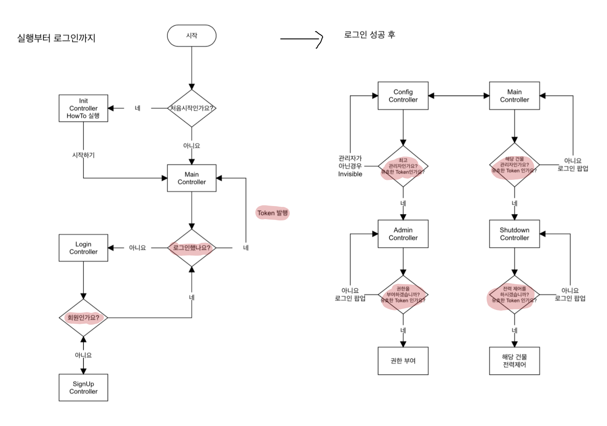

# 인절미 APP

무슨 프로그램인지 이해가 안되신다면 http://bug.lasel.kr/blog/?p=198 를 참고해주세요!!

### FlowChart

형광펜으로 칠한 부분이 다음에 설명할 Network 함수를 사용한 부분입니다.

## 핵심코드 Network 설명

    import UIKit
    import Alamofire

    private enum siteURL: String {
        case server       = "서버URL을 추가해주세요"
        case addURL       = "서버URL을 제외한 나머지 부분을 작성해주세요."
    }
    
    class Network{
        let url: URL
        let method: HTTPMethod
        let parameters: Parameters
    
        init(_ path: String, method: HTTPMethod = .post, parameters: Parameters = [:]) {
            if let url = URL(string: siteURL.server.rawValue + path) {
                self.url = url
            } else {
                self.url = URL(string: siteURL.server.rawValue)!
            }
        
            self.method = method
            self.parameters = parameters
        }
    
        deinit {
            print("network deinit")
        }
    
        func connection(completion: @escaping ( [String: AnyObject] ) -> Void) {
            Alamofire.request(url, method: method, parameters: parameters).responseJSON { response in
                if let JSON = response.result.value{
                    completion(JSON as! [String : AnyObject])
                } else{
                    print("서버와의 연결이 불안정합니다.")
                }
            }
        }
    }
\'

Network Class는 Alamofire를 기반으로한 통신 Class입니다. Network Class는 주소, HTTP규약, 파라미터가 필요합니다.

Network 내 connection 함수를 통해 서버와 JSON 통신이 가능해집니다. 

해당 클래스는 비동기로 작동하며 connection 함수가 완료되면 해당 url을 통해 전달받은 JSON을 리턴하게 됩니다.

다음은 실제 제가 사용한 코드입니다.

    class Network{
        let url: URL
        let method: HTTPMethod
        let parameters: Parameters
        let viewController: UIViewController

        init(_ path: String, method: HTTPMethod = .post, parameters: Parameters = [:], viewController:UIViewController) {
            if let url = URL(string: siteURL.server.rawValue + path) {
                self.url = url
            } else {
                self.url = URL(string: siteURL.server.rawValue)!
            }
        
            self.method = method
            self.parameters = parameters
            self.viewController = viewController
        }
    
        deinit {
            print("network deinit")
        }
    
        func connetion(completion: @escaping ( [String: AnyObject] ) -> Void) {
            let appdelegate = UIApplication.shared.delegate as! AppDelegate
            appdelegate.isshowActivityIndicatory()
        
            Alamofire.request(url, method: method, parameters: parameters).responseJSON { response in
                if let JSON = response.result.value{
                    completion(JSON as! [String : AnyObject])
                } else{
                    appdelegate.showAlert("서버와의 연결이 불안정합니다.")
                }
                appdelegate.invisibleActivityIndicatory()
            }
        }
    }    
\'

팝업창을 뷰 컨트롤러에서 띄우는 것이 아닌 앱 구동 중 항상 열려있는 AppDelegate에서 작동하게 하였습니다. 

해당 코드는 다음과 같습니다.

### AppDelegate 

        // Indicator 보여주기
        func isshowActivityIndicatory() {
            container.frame = UIScreen.main.bounds
            container.center = CGPoint(x: UIScreen.main.bounds.width / 2, y: UIScreen.main.bounds.height / 2)
            
            let loadingView = UIView()
            loadingView.frame = CGRect(x: 0, y: 0, width: 80, height: 80)
            loadingView.center = container.center
            loadingView.backgroundColor = UIColor(white: 0.3, alpha: 0.7)
            loadingView.clipsToBounds = true
            loadingView.layer.cornerRadius = 10
        
            let actInd = UIActivityIndicatorView()
            actInd.frame = CGRect(x: 0, y: 0, width: 40, height: 40)
            actInd.activityIndicatorViewStyle = .whiteLarge
            actInd.center = CGPoint(x: loadingView.frame.width / 2, y: loadingView.frame.height / 2)
        
            loadingView.addSubview(actInd)
            container.addSubview(loadingView)
            window?.addSubview(container)
            actInd.startAnimating()
        }
    
        // Indicator 감추기
        func invisibleActivityIndicatory() {
            for view in (window?.subviews)! {
                if view.isEqual(container){
                    view.removeFromSuperview()
                }
            }
        }
    
        // Alert 보여주기
        func showAlert(_ message:String){
            let alert = UIAlertController(title: "Information", message: "\n\(message)", preferredStyle: .alert)
            alert.addAction(UIAlertAction(title: "확인", style: .default, handler: nil))
        
            DispatchQueue.main.async {
                self.window?.rootViewController?.present(alert, animated: true, completion: nil)
            }
        }
\'

Network Class를 활용하여 앱 내에서 사용하는 모든 통신을 한 곳에 모아 정리하였습니다. 모두 설명하기에 코드가 길어지니 일부분만 발췌하였습니다.

명칭은 APIClient입니다. 코드는 다음과 같습니다.

    class APIClient {
        func logIn(_ id:String, pw:String, loginController:LoginController){
            var parameters: Parameters = ["id" : "", "pwd" : ""]
            parameters["id"] = id
            parameters["pwd"] = pw
        
            let network = Network(siteURL.login.rawValue, method: .post, parameters: parameters, viewController: loginController)
            network.connetion() { response in
                let appDelegate = UIApplication.shared.delegate as! AppDelegate
            
                if let resultCode = response["code"] as? Int, let resultMessage = response["message"] as? String, let resultToken = response["token"] as? String {
                    switch resultCode {
                    case 200:
                        UserDefaults.standard.setToken(value: resultToken)
                        UserDefaults.standard.setRights(value: 1)
                        UserDefaults.standard.setloginId(value: id)
                        loginController.completeLogin()
                        break
                    case 201:
                        UserDefaults.standard.setToken(value: resultToken)
                        UserDefaults.standard.setRights(value: 99)
                        UserDefaults.standard.setloginId(value: id)
                        loginController.completeLogin()
                        break
                    default:
                        appDelegate.showAlert(resultMessage)
                        break
                    }
                } else {
                    appDelegate.showAlert("오류가 발생하였습니다. 재 접속해주세요")
                }
            }
        }
        ..... 중략   
      }
\'

network 객체를 생성하여 인자를 전달해주고 통신이 완료가 되었다면 response로 값을 갖고와 사용자가 원하는 작업을 하는 코드입니다.

## AutoLayout을 위한 anchor함수

    extension UIView {
        func anchorToTop(_ top: NSLayoutYAxisAnchor? = nil, leading: NSLayoutXAxisAnchor? = nil, bottom: NSLayoutYAxisAnchor? = nil, trailing: NSLayoutXAxisAnchor? = nil) {
            
            anchorWithConstantsToTop(top, leading: leading, bottom: bottom, trailing: trailing, topConstant: 0, leadingConstant: 0, bottomConstant: 0, trailingConstant: 0)
        }
        
        func anchorWithConstantsToTop(_ top: NSLayoutYAxisAnchor? = nil, leading: NSLayoutXAxisAnchor? = nil, bottom: NSLayoutYAxisAnchor? = nil, trailing: NSLayoutXAxisAnchor? = nil, topConstant: CGFloat = 0, leadingConstant: CGFloat = 0, bottomConstant: CGFloat = 0, trailingConstant: CGFloat = 0) {
            
            _ = anchor(top, leading: leading, bottom: bottom, trailing: trailing, topConstant: topConstant, leadingConstant: leadingConstant, bottomConstant: bottomConstant, trailingConstant: trailingConstant)
        }
        
        func anchor(_ top: NSLayoutYAxisAnchor? = nil, leading: NSLayoutXAxisAnchor? = nil, bottom: NSLayoutYAxisAnchor? = nil, trailing: NSLayoutXAxisAnchor? = nil, topConstant: CGFloat = 0, leadingConstant: CGFloat = 0, bottomConstant: CGFloat = 0, trailingConstant: CGFloat = 0, widthConstant: CGFloat = 0, heightConstant: CGFloat = 0) -> [NSLayoutConstraint] {
            translatesAutoresizingMaskIntoConstraints = false
            
            var anchors = [NSLayoutConstraint]()
            
            if let top = top {
                anchors.append(topAnchor.constraint(equalTo: top, constant: topConstant))
            }
            
            if let leading = leading {
                anchors.append(leadingAnchor.constraint(equalTo: leading, constant: leadingConstant))
            }
            
            if let bottom = bottom {
                anchors.append(bottomAnchor.constraint(equalTo: bottom, constant: -bottomConstant))
            }
            
            if let trailing = trailing {
                anchors.append(trailingAnchor.constraint(equalTo: trailing, constant: -trailingConstant))
            }
            
            if widthConstant > 0 {
                anchors.append(widthAnchor.constraint(equalToConstant: widthConstant))
            }
            
            if heightConstant > 0 {
                anchors.append(heightAnchor.constraint(equalToConstant: heightConstant))
            }
            
            anchors.forEach({$0.isActive = true})
            
            return anchors
        }
    }
\'

저는 SB보단 Code로 오토레이아웃을 구성하는 것을 선호합니다. 

이유는 SB로 구성하는 것도 좋긴하지만 13인치 노트북으로 두 개의 창을 띄워 왔다갔다하는게 생각보다 불편했습니다. 혹시 27인치 아이맥을 사용하면 다를지도 모르겠네요 ㅎㅎ..

또 Code로 구성하는 것이 제가 원하는 위치에 적재적소로 구성할 수 있고 필요한 형태로 바로 바꿔줄 수 있어 편했습니다.

예를 들면 앱 내에 있는 모든 버튼의 색을 변경하거나 이미지를 한 번에 바꾼다던가 하는 작업을 코드로는 한 번에 변경할 수 있지만 SB는 일일이 변경해야합니다.

이런 이유로 저는 Code를 선호합니다.

위의 코드는 Code로 작성할 떄 자주 사용하던 anchor함수입니다. 총 3개의 함수로 구성되어 있습니다.

anchorToTop함수는 constraint와 width를 제외한 부분만 필요할 때 사용합니다. 나머지는 자동으로 nil 또는 0으로 처리합니다.

anchorWithConstantsToTop함수는 width를 제외한 부분만 필요할 때 사용합니다. 나머지는 마찬가지로 nil 또는 0으 처리합니다.

anchor함수는 모든 부분이 필요할 때 사용합니다. 

이 세 함수는 자동으로 translatesAutoresizingMaskIntoConstraints 코드를 포함하기 때문에 따로 false를 해줄 필요가 없습니다.

사용 예제는 다음과 같습니다.

    // MARK: - 레이아웃 함수 ///////////////////////////////////////////////////////////////////////////////////
    
        private func setupLayout(){
            let bottomControls = UIStackView(arrangedSubviews: [skipButton, pageControl, nextButton])
            bottomControls.translatesAutoresizingMaskIntoConstraints = false
            bottomControls.distribution = .fillEqually
            
            view.addSubview(collectionView)
            view.addSubview(bottomControls)
            view.addSubview(startButton)
            
            collectionView.anchorToTop(view.topAnchor, leading: view.leadingAnchor, bottom: view.bottomAnchor, trailing: view.trailingAnchor)
            pageControlBottomAnchor = bottomControls.anchor(nil, leading: view.leadingAnchor, bottom: view.bottomAnchor, trailing: view.trailingAnchor, topConstant: 0, leadingConstant: 0, bottomConstant: 0, trailingConstant: 0, widthConstant: 0, heightConstant: 40)[1]
            _ = startButton.anchor(nil, leading: view.leadingAnchor, bottom: view.bottomAnchor, trailing: view.trailingAnchor, topConstant: 0, leadingConstant: 0, bottomConstant: 0, trailingConstant: 0, widthConstant: 0, heightConstant: view.frame.height / 5)[1]
            startButton.centerXAnchor.constraint(equalTo: view.centerXAnchor).isActive = true
            startButton.isHidden = true
        }
    
    // MARK: - 끝 ///////////////////////////////////////////////////////////////////////////////////
\'

